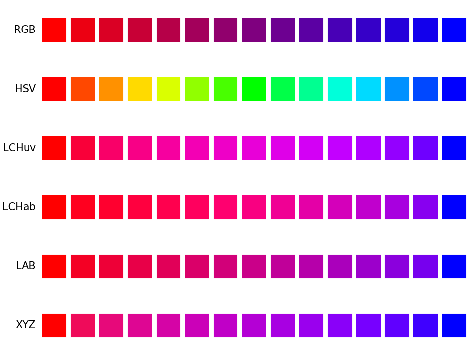

# [PaletteBlendr](https://paletteblendr.vercel.app)


Your one-stop shop for all your color and palette blending needs!

Ever had an existing palette that you wish had one more color? This website takes care of that. While most websites support creating gradients between two colors, 
this website allows you to create palettes with gradients along multiple colors. It supports many color interpolation methods, from the traditional RGB and HSV,
to LCHab and LCHuv, to LAB and XYZ.

See all the possible interpolations below or by running
```bash
python -m example
```

<p align="center" width="100%">
  
</p>

## Website
<p align="center" width="100%">
  
</p>

## API
Interpolate your own colors
```bash
POST /api/color_lerp
```
| Parameter | Type     | Description                |
| :-------- | :------- | :------------------------- |
| `colors` | `array` | **Required**. The colors to interpolate between. It has to be in HEX. |
| `new_size` | `int` | **Required**. The size of the new palette. |

## Run Locally

Clone the project

```bash
  git clone https://github.com/EricLin-jpg/PaletteBlendr.git
```

Go to the project directory

```bash
  cd PaletteBlendr
```

### Docker
To run this project with Docker, you will need to [install Docker and Docker Compose](https://docs.docker.com/get-docker/).

Build the Docker image

```bash
  docker-compose build
```

Start the Docker container

```bash
  docker-compose up
```

### Python
If you do not want to use Docker, you can run this project with Python.

Install dependencies

```bash
  pip install -r requirements.txt
```

Start the server

```bash
  python -m app
```

## Built With

**Frontend:** [Bootstrap](https://getbootstrap.com/), [JQuery](https://jquery.com/)

**Color Picker:** [Pickr](https://github.com/simonwep/pickr)

**Backend:** [Flask](https://flask.palletsprojects.com/)
